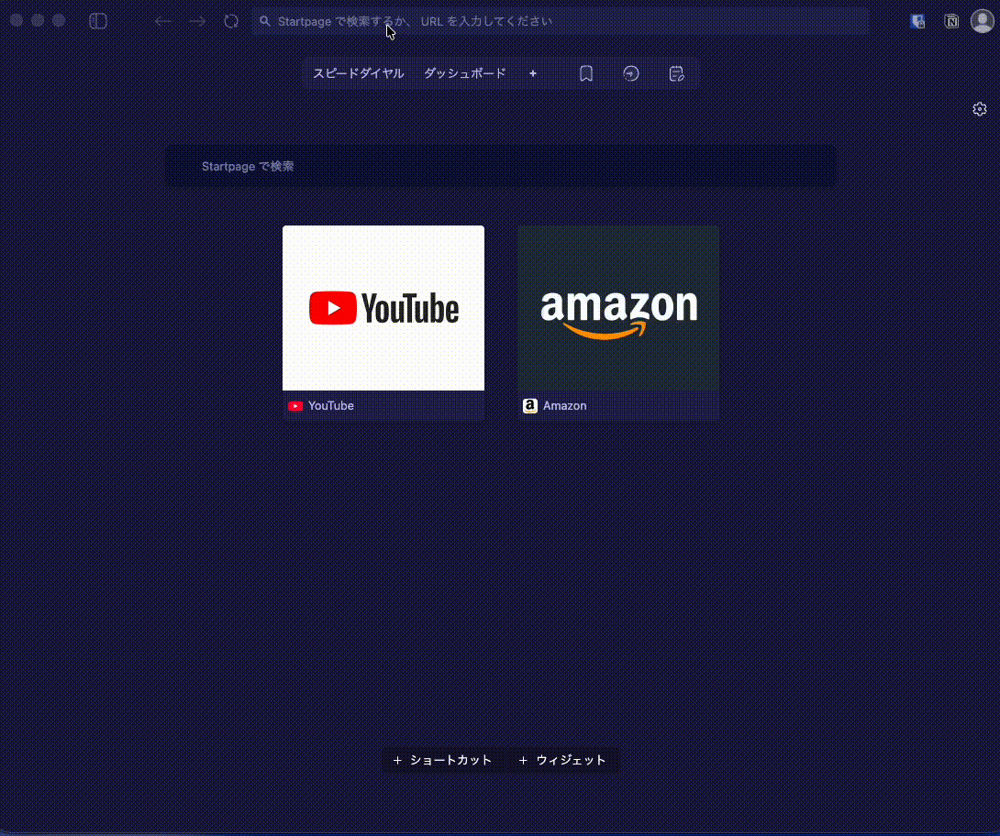

# 💰 MoneyRebirth

> Your money. Your data. Your freedom. | お金のデータを、自分の手に。

複数の金融機関のCSV/PDFを自前のSQLiteデータベースに取り込み、Streamlitでダッシュボード表示する、完全セルフホスト型の資産管理・家計簿システムです。

クラウドサービスに依存せず、自分のデータは自分で管理する。それがMoneyRebirthのコンセプトです。

---

## 📸 スクリーンショット



---

## ✨ 特徴

- **完全ローカル** — データはすべて自分のマシンに。クラウド不要
- **複数金融機関対応** — 銀行・証券・クレジットカード・電子マネーを一元管理
- **フォーマット自動判定** — CSVを放り込むだけ。種別を選ぶ必要なし
- **ブラウザからインポート** — コマンドライン不要、画面からCSV/PDFをアップロード可能
- **重複自動排除** — 同じCSVを何度読み込んでも安全
- **Raspberry Pi対応** — 低消費電力で常時稼働
- **複数年分対応** — MoneyForwardの過去データも一括取込

---

## 🏦 対応サービス

| サービス | 種別 | 形式 |
|---------|------|------|
| MoneyForward ME | 家計簿エクスポート | CSV |
| 三菱UFJ銀行 | 入出金明細 | CSV |
| 三菱UFJ銀行 | お預かり残高 | CSV |
| 三井住友カード（Vpass） | 利用明細 | CSV |
| SBI証券 | 保有証券一覧 | CSV |
| モバイルSuica | 残高ご利用明細 | PDF |

---

## 🖥️ 2つのエディション

### 🏠 ローカル版（`moneyrebirth_dashboard.py`）

自分のマシンで動かす本格版。CSVを蓄積してデータが積み上がる。

```bash
streamlit run moneyrebirth_dashboard.py
```

| ページ | 内容 |
|--------|------|
| 📊 サマリー | 総資産・評価損益・今月支出 |
| 📈 資産推移 | 月次スナップショットの積み上げグラフ |
| 💳 取引履歴 | 口座・月・キーワードで絞り込み |
| 🏦 ポートフォリオ | 銘柄別・セクション別・NISA比率 |
| 📅 年次サマリー | 複数年分の支出推移・カテゴリ別分析 |
| 🗓️ 月次レビュー | カテゴリ別支出内訳・円グラフ |
| ✏️ 手入力 | 現金支出の記録・編集・削除（記録のみ） |
| 📥 インポート | ブラウザからCSV/PDFをアップロードしてDB取り込み |

### ☁️ クラウド版（`moneyrebirth_cloud.py`）

インストール不要。ブラウザでCSV/PDFをアップロードするだけで即解析。

👉 **[今すぐ試す（Streamlit Cloud）](https://moneyrebirth.streamlit.app)**

```bash
# ローカルで試す場合
streamlit run moneyrebirth_cloud.py
```

| ページ | 内容 |
|--------|------|
| 🗓️ 月次レビュー | カテゴリ別支出内訳・円グラフ |
| 📅 年次サマリー | 年別支出推移・カテゴリ別グラフ |
| 💳 取引履歴 | 口座・月・キーワードで絞り込み |
| 🏦 ポートフォリオ | SBI証券の保有銘柄・評価損益 |

> ⚠️ **クラウド版はデモ用途です**
> - アップロードしたデータはサーバーに**保存されません**
> - セッション終了時にデータは消去されます
> - 手入力機能はありません（ローカル版をご利用ください）
> - 本格利用はローカル版を推奨します

---

## 🚀 ローカル版セットアップ

### 必要環境

- Python 3.10+
- pip

### インストール

```bash
git clone https://github.com/moneyrebirth/moneyrebirth.git
cd moneyrebirth
pip install -r requirements.txt
```

### カテゴリファイルの生成（初回のみ）

**MoneyForwardユーザーの場合**

```bash
python3 moneyrebirth-pickupcategories.py
# データベースから自動作成
```

**それ以外の方**
```bash
cp categories_sample.txt categories.txt
# 必要に応じて編集
```

生成された`categories.txt`は手入力ページのカテゴリとして使用されます。

### 起動

```bash
streamlit run moneyrebirth_dashboard.py
```

ブラウザで `http://localhost:8501` を開く。

---

## 📥 データの取り込み方法

### ① ブラウザからインポート（推奨）

ダッシュボードの「📥 インポート」ページを開き、CSV/PDFをドラッグ＆ドロップするだけ。

- フォーマットを自動判定して取り込み
- 重複は自動でスキップ
- コマンドライン不要

### ② コマンドラインからインポート

```bash
# MoneyForward（複数ファイル一括）
for f in ./csv/moneyforward/*.csv; do
    python3 importers/mf_importer.py "$f"
done

# 三菱UFJ 入出金明細
python3 importers/mufg_importer.py mufg_meisai.csv

# 三菱UFJ お預かり残高
python3 importers/mufg_balance_importer.py mufg_balance.csv

# 三井住友カード
python3 importers/smcc_importer.py vpass.csv

# SBI証券
python3 importers/sbi_portfolio_importer.py portfolio.csv

# モバイルSuica PDF
for f in ./pdf/suica/*.pdf; do
    python3 importers/suica_importer.py "$f"
done

# 全て一括
bash import_all.sh
```

---

## ✏️ 手入力について（ローカル版のみ）

現金支出など、CSVに含まれない取引を手動で記録できます。

- **記録のみ**（残高の増減管理は行いません）
- カテゴリ・支出元・メモを設定可能
- 記録した内容は編集・削除可能
- `categories.txt` でカテゴリをカスタマイズ可能

> 💡 財布残高との連携・自動増減はv2以降で対応予定です。

---

## 📁 ファイル構成

```
moneyrebirth/
├── moneyrebirth_dashboard.py      # ローカル版ダッシュボード
├── moneyrebirth_cloud.py          # クラウド版（Streamlit Cloud用）
├── moneyrebirth-pickupcategories.py # DBからカテゴリを自動生成
├── moneyrebirth_categories.py     # カテゴリ読み込みユーティリティ
├── categories.txt                 # カテゴリ設定（自動生成・手動編集可）
├── import_all.sh                  # 一括インポートスクリプト
├── importers/
│   ├── mf_importer.py             # MoneyForward
│   ├── mufg_importer.py           # 三菱UFJ 入出金
│   ├── mufg_balance_importer.py   # 三菱UFJ 残高
│   ├── smcc_importer.py           # 三井住友カード
│   ├── sbi_portfolio_importer.py  # SBI証券
│   └── suica_importer.py          # モバイルSuica
├── parsers/                       # フォーマット判定・パーサー（両版共通）
│   ├── detector.py                # フォーマット自動判定
│   ├── mf_parser.py
│   ├── mufg_parser.py
│   ├── mufg_balance_parser.py
│   ├── smcc_parser.py
│   ├── sbi_parser.py
│   └── suica_parser.py
├── docs/
├── requirements.txt
├── .gitignore
└── README.md
```

---

## 🗃️ データベース構造（ローカル版）

SQLite（`household.db`）に2つのテーブル：

```
transactions  — 入出金・支出履歴
  source      : データソース ('mufg', 'smcc', 'moneyforward', 'suica', 'manual')
  date        : 日付
  description : 摘要・店名
  amount      : 金額（支出:負、収入:正）
  category    : カテゴリ（大項目/中項目）

portfolios    — 資産スナップショット（月次）
  snapshot_date : 取得日
  section       : セクション（'株式（一般預り）'など）
  asset_type    : 種別 ('stock', 'fund', 'bond', 'bank')
  name          : 銘柄名・商品名
  market_value  : 評価額
  gain_loss     : 評価損益
```

---

## 🔒 プライバシー

- `household.db` はローカルのみ（`.gitignore` で除外済み）
- 個人のCSV・PDFファイルも `.gitignore` で除外済み
- 外部サービスへのデータ送信は一切なし
- クラウド版のアップロードデータはセッション終了時に消去

---

## 🗺️ ロードマップ

- [x] MoneyForward CSVインポート
- [x] 三菱UFJ・三井住友カード・SBI証券・Suica対応
- [x] ブラウザからCSV/PDFアップロード（フォーマット自動判定）
- [x] 資産推移・ポートフォリオグラフ
- [x] 月次レビュー・年次サマリー
- [x] 手入力（現金支出の記録・編集・削除）
- [x] **V1.1** Streamlit Cloudクラウド版
- [ ] **v2**: 財布機能・手入力との残高連携
- [ ] **v2**: レシート撮影による自動入力（Claude Vision API活用）
- [ ] **v2**: カテゴリ自動分類（AI活用）
- [ ] **v2**: 楽天銀行・イオン銀行など対応金融機関追加

---

## 🤝 コントリビューション

対応していない金融機関のCSVフォーマットを [Issues](https://github.com/moneyrebirth/moneyrebirth/issues) で教えてください。一緒に対応します。

---

## 📝 記事
- [【Python×Claude】金融データを自分の手に取り戻す。3日で家計簿アプリ「MoneyRebirth」を作った話](https://zenn.dev/dai610/articles/7c03c57176a90f)

---

## 📄 ライセンス

MIT License

---

*Built with Claude — because your financial data should be yours.*
